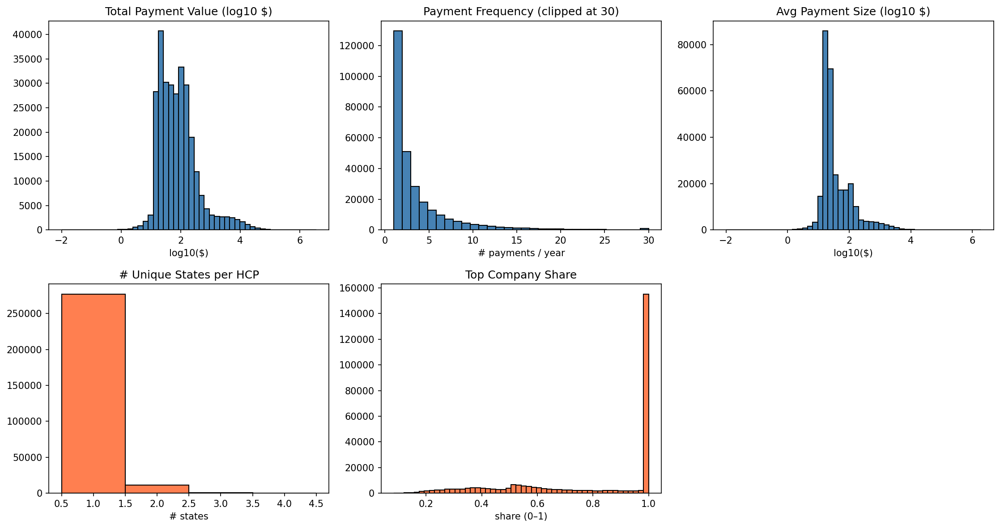
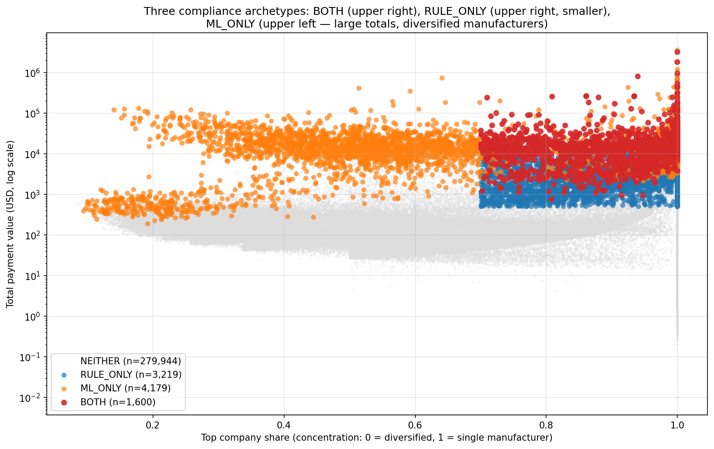
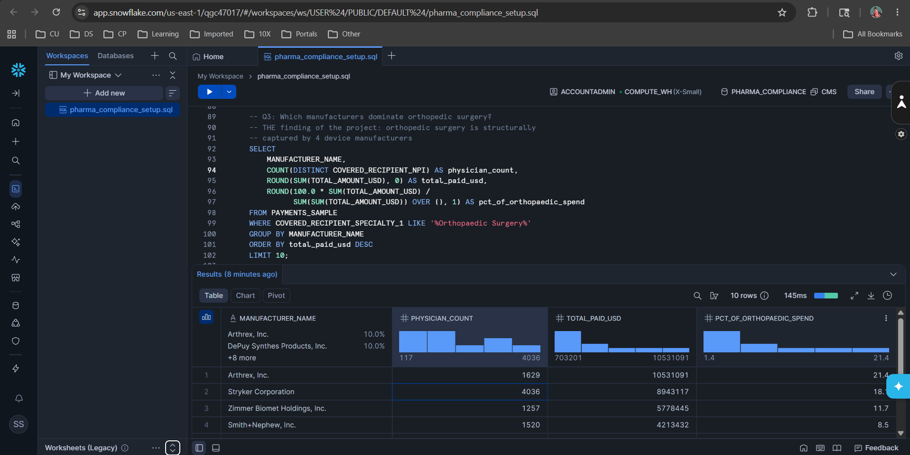
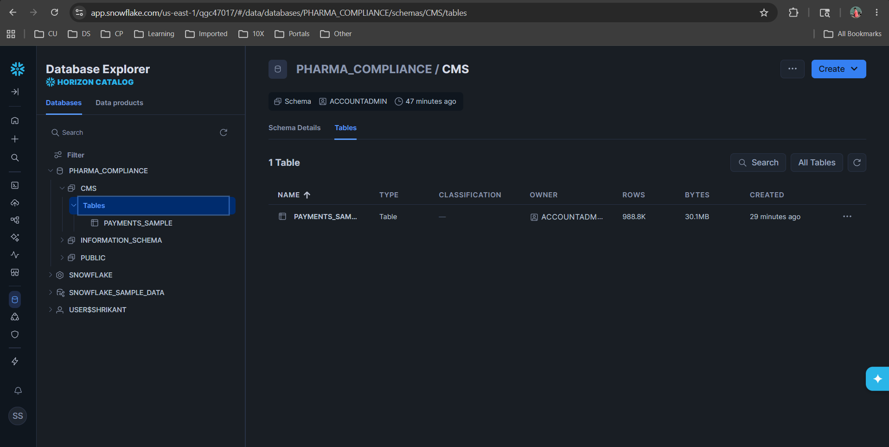

# Pharma Compliance Spend Analytics

> End-to-end compliance spend analytics on real CMS Open Payments data: anomaly detection, tiered risk classifier, and an interactive Tableau dashboard surfacing the relationships that compliance teams actually need to investigate.

[](https://www.python.org)
[](https://pandas.pydata.org)
[](https://numpy.org)
[](https://scipy.org)
[](https://public.tableau.com/app/profile/shrikant.sharma)
[](https://opensource.org/licenses/MIT)

**🔗 [Live Interactive Dashboard on Tableau Public →](https://public.tableau.com/views/pharma_compliance_dashboard/GeographicSpecialtyOverview?:language=en-US&:sid=&:redirect=auth&:display_count=n&:origin=viz_share_link)**



---

## Why This Project

The Sunshine Act requires pharmaceutical and medical-device manufacturers to publicly report every payment to U.S. physicians. The 2024 CMS Open Payments dataset contains **16.16 million records totaling $13.18 billion**. Far more than any compliance team can manually review.

This project answers a question compliance teams ask every quarter: *"Of all the physicians who received payments this year, which ones should we investigate first?"*

The system combines two complementary statistical methods with a compliance-specific domain rule to produce a **tiered triage queue** that focuses human review on the highest-risk relationships first. This same triage logic used in production compliance monitoring at major pharma companies, applied here to publicly available federal data.

---

## Pipeline

```
┌─────────────────────────────┐
│ CMS Open Payments 2024 CSV  │
│ 16.16M records, ~6 GB       │
└──────────────┬──────────────┘
               │ chunked read (500K rows × 32)
               │ filter: physicians only
               │ filter: drop null NPI / amount
               │ random 10% sample (seed=42)
               ▼
┌─────────────────────────────┐
│ Sampled transactions        │
│ ~989K rows × 10 columns     │
└──────────────┬──────────────┘
               │ groupby NPI + derived features
               ▼
┌─────────────────────────────┐
│ HCP-level table             │
│ ~289K HCPs × 5 features     │
│ - total_payment_value       │
│ - payment_frequency         │
│ - avg_payment_size          │
│ - n_unique_states           │
│ - top_company_share         │
└──────────────┬──────────────┘
               │ within-specialty z-score (3 features)
               │ global IQR outliers (3 features)
               │ compliance concentration rule
               ▼
┌─────────────────────────────┐
│ Tiered risk classifier      │
│ HIGH / MEDIUM / LOW / NONE  │
└──────────────┬──────────────┘
               │
               ▼
┌─────────────────────────────┐
│ Tableau Public dashboard    │
│ Geographic + Specialty +    │
│ Company + Trend + Detail    │
└─────────────────────────────┘
```

---

## Key Design Decisions

| Decision | Choice | Why |
|---|---|---|
| **Filter to physicians only** | Drop teaching hospitals & non-physician practitioners | Cleanest analytical unit: every physician has a unique NPI, specialty, and state. Mixing in teaching hospitals (no specialty) would corrupt specialty-level z-scores. |
| **10% random sample** | `frac=0.1`, `random_state=42` | The full 16M-row file doesn't fit comfortably in 16 GB RAM. A random sample preserves distributional shape, which is what z-score and IQR rely on. The same code runs on the full file with one parameter change. |
| **Z-score within specialty** | Group by `Covered_Recipient_Specialty_1`, min 30 HCPs/specialty | Different specialties have wildly different payment baselines. Orthopedic surgeons routinely receive larger device payments than pediatricians; a single global z-score would flag entire specialties rather than unusual individuals. |
| **Both z-score AND IQR** | Compute both, combine in tier logic | The CMS payment distribution is heavily right-skewed (median $21, max $3.2M). Right-skew inflates the standard deviation enough that even genuine outliers fall below z=2.IQR catches what z-score misses. **Receipt: on `total_payment_value`, IQR flagged 30,223 HCPs that z-score missed.** |
| **Concentration with monetary floor** | `top_company_share > 0.7 AND total_payment_value > $500` | The median `top_company_share` is 1.0 (half of all HCPs received a single payment from a single rep). A naïve concentration flag would alert on 50%+ of physicians. The $500 floor strips out the casual food-and-beverage population and leaves the relationships that actually involve compensation. |
| **Tiered classifier (not binary)** | HIGH / MEDIUM / LOW / NONE based on signal count | A binary "flagged / not flagged" output is unusable when 17% of the population qualifies. Tiering gives the compliance team a triage queue: HIGH first (1.7%, manageable manual review), automated rules for MEDIUM/LOW. |

---

## Results

### Tier breakdown (288,942 HCPs total)

| Tier | Count | % of total | What it represents |
|---|---|---|---|
| **HIGH** | 4,819 | 1.67% | All three signals fire: the actionable manual-review queue |
| **MEDIUM** | 23,423 | 8.11% | High value with concentration, or high value with high frequency |
| **LOW** | 22,772 | 7.88% | Single statistical signal, no concentration |
| **NONE** | 237,928 | 82.34% | Below all thresholds |

---

## ML Anomaly Detection Layer — Isolation Forest

After shipping the rule-based detection system, I added an unsupervised ML layer to answer a question every compliance team eventually asks: *what does each method catch that the other misses?*

### Method

- **Model:** Isolation Forest (`n_estimators=200`, `contamination=0.02`, `random_state=42`) on the same 5 engineered features used by the rules.
- **Why this model:** unsupervised (CMS provides no labels), multivariate (catches feature *combinations* rules can't express), tree-based (no feature scaling required given the wildly different feature scales).
- **Why `contamination=0.02`:** matched to the rule-based HIGH rate (1.67%) so the flag volumes are comparable. Identical contamination would over-anchor; 0.02 gives ML modest room to disagree while keeping the comparison interpretable.

### Results — agreement between methods

| | ML flagged | ML inlier | Total |
|---|---|---|---|
| **Rule HIGH** | 1,600 | 3,219 | 4,819 |
| **Not rule HIGH** | 4,179 | 279,944 | 284,123 |
| **Total** | 5,779 | 283,163 | 288,942 |

| Metric | Value |
|---|---|
| Jaccard similarity | 0.178 |
| % of rule-HIGH also flagged by ML | 33.2% |
| % of ML flags also rule-HIGH | 27.7% |
| Cohen's kappa (chance-corrected agreement) | 0.289 |

### Finding — Three distinct compliance archetypes

The disagreement is the finding. Methods catch structurally different patterns:

| Archetype | Group | n | Median total | Median avg pmt | Top company share | Typical specialties |
|---|---|---|---|---|---|---|
| **Captured specialist** | BOTH | 1,600 | $13,742 | $828 | 0.93 | Orthopedic surgery, dental |
| **Captured generalist** | RULE_ONLY | 3,219 | $3,070 | $254 | 0.91 | General practice, cardiology, oncology, pediatrics |
| **Industry consultant** | ML_ONLY | 4,179 | $13,111 | **$1,529** | 0.63 | Dermatology, oncology, rheumatology, advanced cardiology |

**1. Captured specialists (BOTH).** Both methods agree on the unambiguous compliance leads — high-volume device-manufacturer relationships in orthopedic surgery and dental. Top 5 most-anomalous-by-ML in this group are dominated by Stryker, Zimmer Biomet, Skeletal Dynamics, and Align Technology. This is the consensus triage queue.

**2. Captured generalists (RULE_ONLY).** Rules surface 3,219 physicians outside high-spend specialties who receive modest absolute totals (~$3K median) but heavily concentrated payments from a single manufacturer (≥91% top share). ML doesn't isolate them because in absolute multivariate space they look ordinary. **This is precisely why pure-ML is risky for compliance** — small-dollar captured-prescriber patterns are exactly the cases where the *pattern* matters more than the magnitude. Rules win this category.

**3. Industry consultants (ML_ONLY).** ML surfaces 4,179 physicians who earn high totals across *many* manufacturers — diversified industry influence rather than single-firm capture. Median average payment is $1,529, the highest of any group, and ~63% top-company-share means most payments come from secondary sources. Rules cannot catch them because the concentration signal explicitly excludes diversified physicians. ML catches them via the combination: high magnitude + high per-payment + multi-state + diversified manufacturers is an isolated combination in feature space. This is the multivariate signal pure-rules cannot express.

### What the visualization shows



X-axis is concentration (0 = diversified, 1 = single manufacturer). Y-axis is total payment value, log scale. BOTH (red) and RULE_ONLY (blue) cluster on the right — concentrated relationships. **ML_ONLY (orange) sits on the upper LEFT** — physicians with large totals and diversified manufacturer mix. That left-side cluster is the regime no rule-based system can reach.

### Production recommendation

A real compliance system should run both detectors and triage each archetype separately:

- **BOTH** → highest priority, both signals fire.
- **RULE_ONLY** → review for captured-prescriber patterns in low-spend specialties.
- **ML_ONLY** → review for industry-consultant patterns; candidates for *new rule definitions* (e.g., "diversified high-magnitude relationships").

Either method alone misses ~67–72% of what the other catches. The pair is strictly stronger.

### Top HIGH-risk HCPs — the headline finding

The top 10 HIGH-risk physicians by total payment value are **all orthopedic-related specialists**, with **9 of 10 receiving over 99% of their payments from a single device manufacturer**:

| Rank | Specialty | State | Total Paid | Frequency | Top Company | Share |
|---|---|---|---|---|---|---|
| 1 | Adult Reconstructive Orthopedic Surgery | ID | $3,200,055 | 14 | Zimmer Biomet | 100% |
| 2 | Vascular & Interventional Radiology | AZ | $1,813,137 | 13 | Boston Scientific | 100% |
| 3 | Orthopaedic Surgery | NY | $950,342 | 19 | Arthrex | 100% |
| 4 | Orthopaedic Sports Medicine | IL | $808,444 | 10 | Arthrex | 94% |
| 5 | Orthopaedic Surgery | IL | $543,748 | 29 | Stryker | 100% |
| 6 | Orthopaedic Surgery | MN | $442,356 | 11 | Stryker | 100% |
| 7 | Orthopaedic Surgery | GA | $435,248 | 9 | Stryker | 100% |
| 8 | Adult Reconstructive Orthopedic Surgery | NY | $312,872 | 19 | Stryker | 100% |
| 9 | Orthopaedic Surgery | WI | $302,522 | 22 | Stryker | 100% |
| 10 | Orthopaedic Surgery | NY | $265,922 | 18 | Smith+Nephew | 86% |

**Interpretation:** Orthopedic surgeons are the highest-leverage prescribers for joint-replacement and sports-medicine devices. The top 10 list reveals a structural pattern. Four manufacturers (Stryker, Arthrex, Zimmer Biomet, Boston Scientific) collectively dominate orthopedic-physician compensation. This is exactly the kind of concentration the Sunshine Act was designed to make visible.

---

## Tech Stack

- **Python 3.10+** : `pandas`, `numpy`, `scipy`, `matplotlib`, `seaborn`
- **Tableau Public** : interactive dashboards
- **Jupyter** : analysis notebook
- **Git** : version control

---

## Repository Structure

```
pharma-compliance-spend-analytics/
├── notebooks/
│   └── 01_data_features.ipynb     # End-to-end pipeline
├── output/
│   ├── hcp_features.csv           # HCP-level features (no flags)
│   ├── hcp_features_with_flags.csv # HCP features + risk tiers (Tableau input)
│   └── feature_distributions.png  # Distribution visualizations
├── data/                          # gitignored, see "How to Run"
├── requirements.txt
├── .gitignore
└── README.md
```

---

## How to Run

### 1. Clone and set up environment

```bash
git clone https://github.com/Shrikant-Sharma/pharma-compliance-spend-analytics.git
cd pharma-compliance-spend-analytics
python -m venv .venv
.venv\Scripts\activate   # Windows
# source .venv/bin/activate  # macOS/Linux
pip install -r requirements.txt
```

### 2. Download the CMS data

The 2024 General Payments file is too large to host on GitHub (~6 GB). Download from CMS:

```
https://download.cms.gov/openpayments/PGYR2024_P06302025_06162025/OP_DTL_GNRL_PGYR2024_P06302025_06162025.csv
```

Save as `data/general_payments_2024.csv`.

### 3. Run the notebook

```bash
jupyter notebook notebooks/01_data_features.ipynb
```

Run all cells. Total runtime: ~3 minutes on a modern laptop.

### 4. Open the Tableau workbook (optional)

The published version is on [Tableau Public](https://public.tableau.com/shared/GFWDZJ8WF). To rebuild locally, use the `output/hcp_features_with_flags.csv` and `output/payments_sampled.csv` (regenerated by the notebook) as data sources in Tableau Desktop.

---

## Snowflake Implementation

After shipping the rule-based and ML detection systems in Pandas, I ported the 989K-row CMS sample to Snowflake to demonstrate the production analytics path. Five SQL queries — captured in [`sql/snowflake_queries.sql`](sql/snowflake_queries.sql) — reproduce the key findings from the Pandas EDA in a fully scalable cloud data warehouse.

### Setup

```sql
CREATE DATABASE PHARMA_COMPLIANCE;
CREATE SCHEMA   PHARMA_COMPLIANCE.CMS;

-- payments_sampled.csv loaded via Snowsight wizard;
-- column names normalized via ALTER TABLE RENAME COLUMN.
-- Final table: PHARMA_COMPLIANCE.CMS.PAYMENTS_SAMPLE (988,821 rows × 10 cols)
```

Compute: default `COMPUTE_WH` (X-SMALL, auto-suspends after 10 min). The full query suite runs in under 2 seconds on the 989K-row table.

### Headline finding — orthopaedic surgery's manufacturer capture

Top manufacturers by total payments within Orthopaedic Surgery, with each one's share of the specialty's total spend:

| Manufacturer | Physicians paid | Total paid (USD) | Share of orthopaedic spend |
|---|---:|---:|---:|
| Arthrex, Inc. | 1,629 | $10,531,091 | **21.4%** |
| Stryker Corporation | 4,036 | $8,943,117 | **18.1%** |
| Zimmer Biomet Holdings | 1,257 | $5,778,445 | **11.7%** |
| Smith+Nephew, Inc. | 1,520 | $4,213,432 | **8.5%** |
| DePuy Synthes Products | 117 | $3,951,145 | 8.0% |
| Globus Medical | 691 | $1,495,449 | 3.0% |
| Medtronic, Inc. | 636 | $1,431,317 | 2.9% |

**Top 4 manufacturers capture 59.7% of all orthopaedic surgery payments. Top 5 capture 67.7%.** No other specialty in the dataset shows structural concentration at this magnitude.

Notable outlier — **DePuy Synthes pays only 117 physicians but moves $3.95M** ($33,770 per physician, the highest concentration-per-physician of any major orthopaedic manufacturer). Arthrex spreads $10.5M across 1,629 physicians ($6,464 per physician). Same specialty, fundamentally different go-to-market patterns.



### Other findings reproduced in SQL

**Cross-industry manufacturer dispersion:** Stryker leads total payments with only 14,812 transactions; AbbVie has 93,880 transactions (6× more) but lower total. Classic device-royalty vs pharma-marketing structural difference.

**Specialty disparity:** Orthopaedic Surgery is #1 in total spend with 8,901 physicians; Internal Medicine has 41,349 physicians (4.6× more) but ranks below in total dollars. Average per physician differs by an order of magnitude.

**Payment distribution shape (988,821 transactions):**

| Statistic | Value |
|---|---:|
| Mean payment | $220.87 |
| Median (P50) | $21.26 |
| P75 | $33.11 |
| P90 | $137.73 |
| P95 | $458.30 |
| P99 | $3,955.00 |
| Max single payment | $3,199,444.94 |

Mean is roughly 10× median — extreme right skew. This data shape justifies the rule-based system's use of IQR (Q3 + 1.5·IQR) alongside z-score: the long tail inflates standard deviation enough to hide moderate outliers from z-score detection. SQL percentiles confirm what Pandas distribution analysis showed.

### Why Snowflake?

Pandas handles the 989K-row sample comfortably in memory. The full 16M-row dataset doesn't — and a production compliance system would run on the full data across multiple program years, joined to investigation outcomes, refreshed weekly. Snowflake is the canonical platform for that workload in regulated industries: decoupled compute and storage, standard SQL (queries portable to Postgres / BigQuery / Databricks SQL with minor changes), and auto-suspending warehouses that bill only for active compute. The implementation here proves the migration path: same logic, scaled platform.



---

## What I Learned

- **Right-skew breaks z-score.** On `total_payment_value`, z-score within specialty flagged 1.5% of HCPs, *fewer* than the 2.3% expected from a normal distribution. The standard deviation was inflated badly enough by the long tail that even genuine outliers fell below z=2. Switching to IQR caught **30,223 additional HCPs** that z-score missed.
- **Domain rules outperform pure statistics.** A naïve "flag everyone with `top_company_share > 0.7`" rule would have flagged 50%+ of the dataset because the median share is 1.0 (most physicians who receive payments only get them from one rep). Adding a $500 monetary floor to the concentration rule cut the flag rate from 73.7% to 17.7% without losing a single HIGH-tier HCP.
- **Tiered triage matters.** Compliance teams can't review 50,000 flags. They can review ~5,000 HIGH-tier flags. The tier system isn't theoretical polish. It's the difference between a system that gets adopted and one that gets ignored.
- **Specialty-level structure is a finding, not a parameter.** Going in, I expected anomalies to be distributed across specialties. The data revealed that orthopedic surgery is structurally captured by four device manufacturers, a finding that wouldn't have surfaced without specialty-level grouping in the analysis.

---

## Author

**Shrikant Sharma** — Data Scientist with ~8 years across pharma and financial services. Building production ML and grounded RAG systems for regulated industries.

- 🔗 [LinkedIn](https://www.linkedin.com/in/shrikant-sharma)
- 🔗 [Tableau Public](https://public.tableau.com/app/profile/shrikant.sharma)
- 🔗 [GitHub](https://github.com/Shrikant-Sharma)

---

## License

MIT.See [LICENSE](LICENSE).
